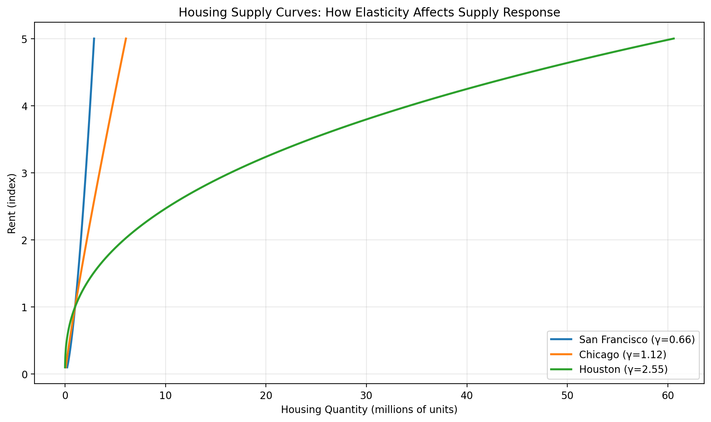

# Housing Supply


<!-- WARNING: THIS FILE WAS AUTOGENERATED! DO NOT EDIT! -->

## Where Do Rents Come From?

In the Rosen-Roback model, rents are determined by the **housing
market**. Supply meets demand:

- **Supply**: Developers build housing when rents are high
- **Demand**: Workers need housing (assume 1 unit per worker)
- **Equilibrium**: Housing supply = Housing demand (= population)

## The Housing Supply Function

Housing supply responds to rents:

*H* = *S* ⋅ *r*<sup>*γ*</sup>

where:

- *H* = housing units supplied
- *S* = supply shifter (land availability, construction costs)
- *r* = rent
- *γ* = **supply elasticity**

### What is Supply Elasticity?

The elasticity *γ* measures how responsive supply is to price:

$$\gamma = \frac{\\ \Delta H}{\\ \Delta r}$$

**Examples** (from Saiz 2010):

- **Houston**: *γ* ≈ 2.5 (very elastic - flat land, few regulations)
- **Chicago**: *γ* ≈ 1.1 (moderate)
- **Los Angeles**: *γ* ≈ 0.76 (inelastic - geography + regulations)
- **San Francisco**: *γ* ≈ 0.66 (very inelastic - peninsula + strict
  zoning)

**Why does elasticity vary?**

- Geography: mountains, water bodies limit building
- Regulations: zoning, height limits, environmental reviews
- Land availability: room to sprawl vs. built-up

## Equilibrium Rent

In equilibrium, housing supply equals population:

*H* = *L*

Solving for rent:

$$r = \left(\frac{L}{S}\right)^{1/\gamma}$$

**Key insight**: When supply is inelastic (low *γ*), the exponent 1/*γ*
is large, so rent increases sharply with population.

------------------------------------------------------------------------

### rent_elasticity_with_respect_to_population

>      rent_elasticity_with_respect_to_population (population:float,
>                                                  supply_shifter:float,
>                                                  elasticity:float)

*Calculate the elasticity of rent with respect to population.*

<table>
<thead>
<tr class="header">
<th></th>
<th><strong>Type</strong></th>
<th><strong>Details</strong></th>
</tr>
</thead>
<tbody>
<tr class="odd">
<td>population</td>
<td>float</td>
<td>Current population</td>
</tr>
<tr class="even">
<td>supply_shifter</td>
<td>float</td>
<td>Supply shifter parameter</td>
</tr>
<tr class="odd">
<td>elasticity</td>
<td>float</td>
<td>Supply elasticity (gamma)</td>
</tr>
<tr class="even">
<td><strong>Returns</strong></td>
<td><strong>float</strong></td>
<td></td>
</tr>
</tbody>
</table>

------------------------------------------------------------------------

### equilibrium_rent

>      equilibrium_rent (population:float, supply_shifter:float,
>                        elasticity:float)

*Calculate equilibrium rent where housing supply equals population.*

<table>
<thead>
<tr class="header">
<th></th>
<th><strong>Type</strong></th>
<th><strong>Details</strong></th>
</tr>
</thead>
<tbody>
<tr class="odd">
<td>population</td>
<td>float</td>
<td>City population (= housing demand)</td>
</tr>
<tr class="even">
<td>supply_shifter</td>
<td>float</td>
<td>Supply shifter parameter (S)</td>
</tr>
<tr class="odd">
<td>elasticity</td>
<td>float</td>
<td>Supply elasticity (gamma)</td>
</tr>
<tr class="even">
<td><strong>Returns</strong></td>
<td><strong>float</strong></td>
<td></td>
</tr>
</tbody>
</table>

------------------------------------------------------------------------

### housing_supply

>      housing_supply (rent:float, supply_shifter:float, elasticity:float)

*Calculate housing supply given rent and supply parameters.*

<table>
<thead>
<tr class="header">
<th></th>
<th><strong>Type</strong></th>
<th><strong>Details</strong></th>
</tr>
</thead>
<tbody>
<tr class="odd">
<td>rent</td>
<td>float</td>
<td>Housing rent</td>
</tr>
<tr class="even">
<td>supply_shifter</td>
<td>float</td>
<td>Supply shifter parameter (S)</td>
</tr>
<tr class="odd">
<td>elasticity</td>
<td>float</td>
<td>Supply elasticity (gamma)</td>
</tr>
<tr class="even">
<td><strong>Returns</strong></td>
<td><strong>float</strong></td>
<td></td>
</tr>
</tbody>
</table>

Examples:

``` python
# Calculate housing supply at a given rent
h = housing_supply(rent=100, supply_shifter=1000, elasticity=2.0)
assert h == 1000 * (100**2.0)

# Calculate equilibrium rent where supply equals 1M population
r = equilibrium_rent(population=1_000_000, supply_shifter=1_000_000, elasticity=2.0)
assert np.isclose(r, 1.0)  # Should be 1 when pop = shifter

# Verify equilibrium condition: H = L
h_eq = housing_supply(r, 1_000_000, 2.0)
assert np.isclose(h_eq, 1_000_000)
```

## The Power of Elasticity

Let’s see how different supply elasticities affect the rent response to
population growth.

``` python
# Compare rent response across cities with different elasticities
supply_shifter = 1_000_000  # Calibrated so rent ≈ 1 at 1M population with gamma=2
base_population = 1_000_000
new_population = 1_500_000  # 50% population growth

# Empirical elasticities from Saiz (2010)
cities = [
    ("Houston", 2.55),
    ("Austin", 1.63),
    ("Chicago", 1.12),
    ("Los Angeles", 0.76),
    ("San Francisco", 0.66),
]

print("Effect of 50% Population Growth on Rents")
print("=" * 70)
print(f"{'City':<20} {'Elasticity (γ)':>15} {'Initial Rent':>12} {'New Rent':>12} {'% Increase':>12}")
print("-" * 70)

for city_name, gamma in cities:
    initial_rent = equilibrium_rent(base_population, supply_shifter, gamma)
    new_rent = equilibrium_rent(new_population, supply_shifter, gamma)
    pct_increase = (new_rent / initial_rent - 1) * 100

    print(f"{city_name:<20} {gamma:>15.2f} {initial_rent:>12.2f} {new_rent:>12.2f} {pct_increase:>11.1f}%")

print("-" * 70)
print("\nKey insight: Inelastic cities (low γ) see much larger rent increases!")
```

    Effect of 50% Population Growth on Rents
    ======================================================================
    City                  Elasticity (γ) Initial Rent     New Rent   % Increase
    ----------------------------------------------------------------------
    Houston                         2.55         1.00         1.17        17.2%
    Austin                          1.63         1.00         1.28        28.2%
    Chicago                         1.12         1.00         1.44        43.6%
    Los Angeles                     0.76         1.00         1.70        70.5%
    San Francisco                   0.66         1.00         1.85        84.8%
    ----------------------------------------------------------------------

    Key insight: Inelastic cities (low γ) see much larger rent increases!

## Rent Elasticity

The elasticity of rent with respect to population is simply 1/*γ*. This
tells us how much rents respond to population changes.

``` python
print("Rent Elasticity with Respect to Population")
print("=" * 70)
print(f"{'City':<20} {'Supply Elasticity (γ)':>25} {'Rent Elasticity (1/γ)':>25}")
print("-" * 70)

for city_name, gamma in cities:
    rent_elast = 1 / gamma
    print(f"{city_name:<20} {gamma:>25.2f} {rent_elast:>25.2f}")

print("-" * 70)
print("\nInterpretation: In San Francisco (γ=0.66), a 1% population increase")
print("                causes a 1.5% rent increase.")
print("                In Houston (γ=2.55), the same 1% increase")
print("                causes only a 0.4% rent increase.")
```

    Rent Elasticity with Respect to Population
    ======================================================================
    City                     Supply Elasticity (γ)     Rent Elasticity (1/γ)
    ----------------------------------------------------------------------
    Houston                                   2.55                      0.39
    Austin                                    1.63                      0.61
    Chicago                                   1.12                      0.89
    Los Angeles                               0.76                      1.32
    San Francisco                             0.66                      1.52
    ----------------------------------------------------------------------

    Interpretation: In San Francisco (γ=0.66), a 1% population increase
                    causes a 1.5% rent increase.
                    In Houston (γ=2.55), the same 1% increase
                    causes only a 0.4% rent increase.

## Tests

## Visualizing Supply Curves

Let’s plot housing supply curves for different elasticities.

``` python
# This cell would create a visualization if matplotlib is available
try:
    import matplotlib.pyplot as plt

    rents = np.linspace(0.1, 5, 100)
    supply_shifter = 1_000_000

    fig, ax = plt.subplots(figsize=(10, 6))

    for gamma, label in [(0.66, "San Francisco (γ=0.66)"), (1.12, "Chicago (γ=1.12)"), (2.55, "Houston (γ=2.55)")]:
        quantities = [housing_supply(r, supply_shifter, gamma) for r in rents]
        ax.plot(np.array(quantities) / 1e6, rents, label=label, linewidth=2)

    ax.set_xlabel("Housing Quantity (millions of units)")
    ax.set_ylabel("Rent (index)")
    ax.set_title("Housing Supply Curves: How Elasticity Affects Supply Response")
    ax.legend()
    ax.grid(True, alpha=0.3)
    plt.tight_layout()
    plt.show()
except ImportError:
    print("Matplotlib not available for visualization")
```



## Key Insights

1.  **Supply elasticity is crucial**: It determines how much rents rise
    when population increases
2.  **Inelastic supply → rent spikes**: Cities with geographic or
    regulatory constraints see explosive rent growth
3.  **Elastic supply → stable rents**: Cities with room to build can
    absorb population growth
4.  **Policy matters**: Zoning and planning regulations directly affect
    *γ*

### Why This Matters for Policy

**If a productive city has inelastic housing supply**:

- Workers face high rents
- Many workers are priced out
- They move to less productive cities
- **National GDP falls**

This is the mechanism behind the Hsieh-Moretti (2019) finding that
housing constraints in high-productivity cities reduce U.S. GDP by
3.7-8.9%.
